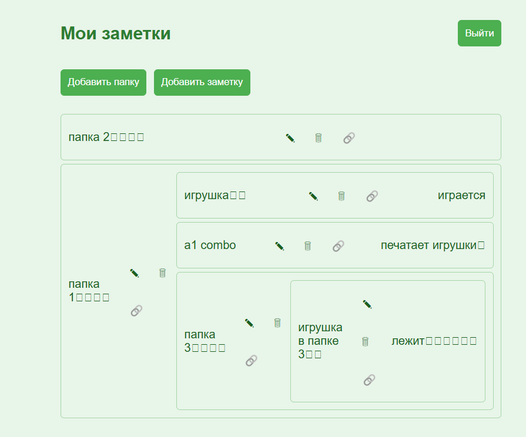
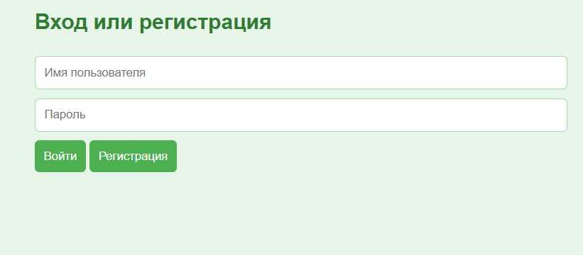
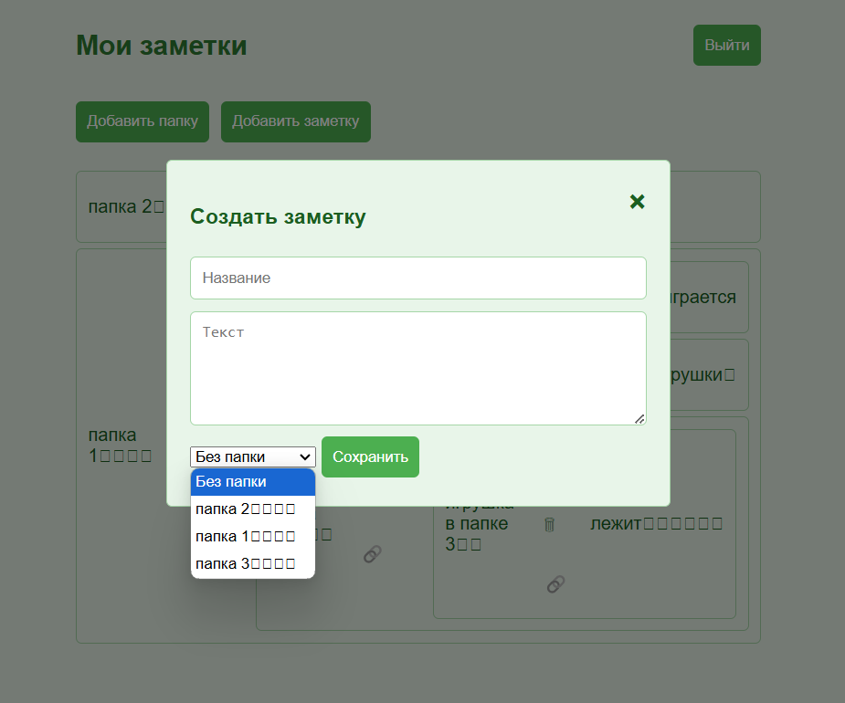
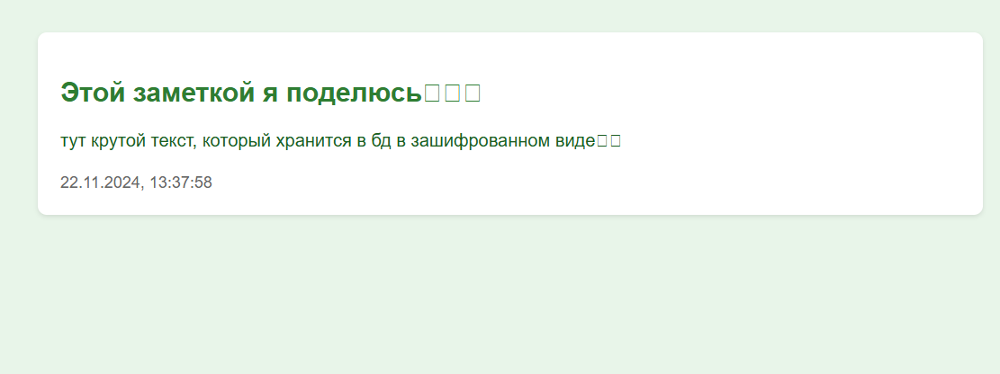
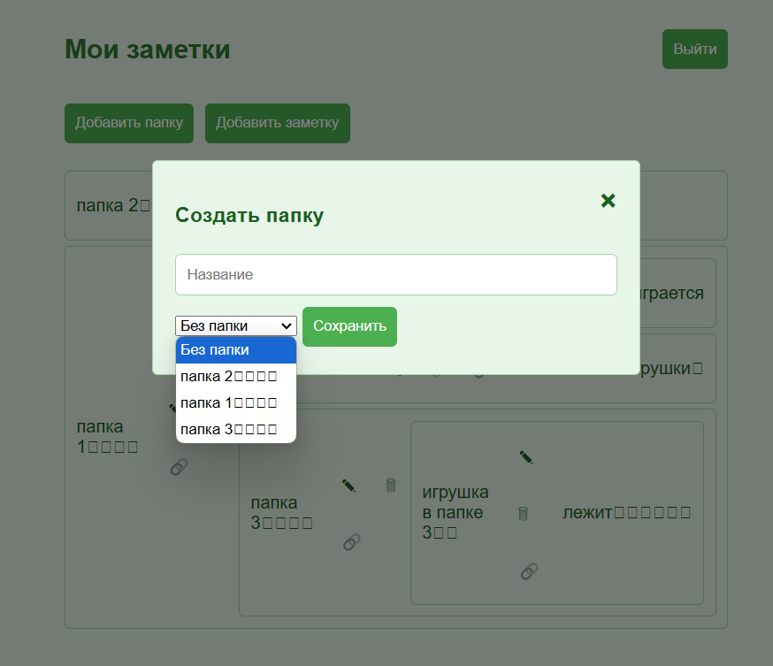
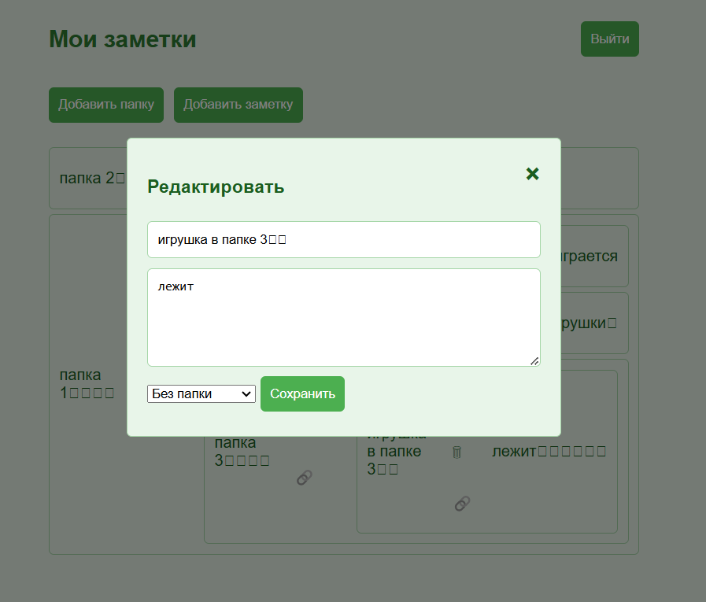

# Проект Заметки

Этот проект представляет собой веб-приложение для создания, редактирования, удаления и обмена заметками. Пользователи могут регистрироваться, входить в систему и управлять своими заметками через удобный интерфейс.

## Возможности

- Регистрация и авторизация пользователей
- Создание, редактирование и удаление заметок
- Организация заметок в папки
- Обмен заметками через уникальные ссылки
- Шифрование заметок для обеспечения безопасности

## Скриншоты

### Главная страница

### Регистрация

### Создание заметки

### Заметка, полученная по ссылке

### Создание папки

### Редактирование заметки

#### Квадратики в конце текста появляются из-за шифрования, они есть только на фронтенде. Как от них избавиться я пока не знаю.
